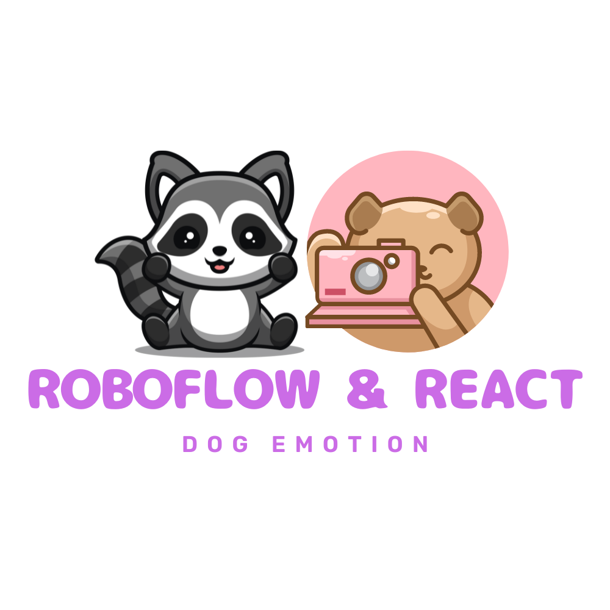
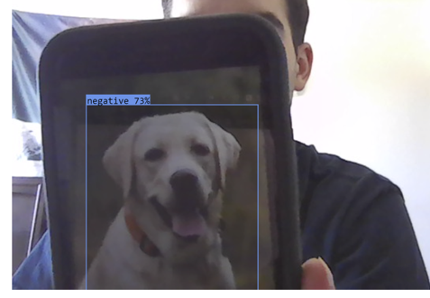
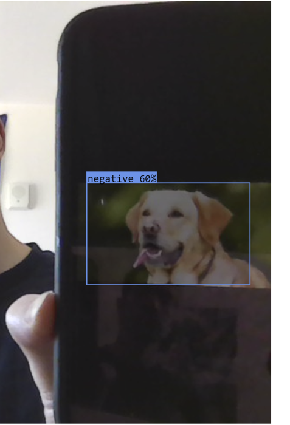
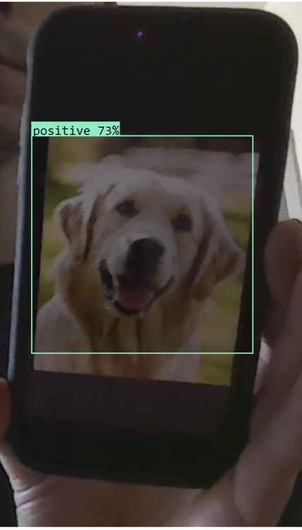

<p align="center">
    
</p>

# Roboflow + React Demo
Accessed your front facing camera and runs roboflow computer vision model to object detect on video feed.
This used the dataset and model found in [Dog Emotion Detection](https://github.com/stayingcozy/dog_emotion_detection)

## Demo
<div align="center">
  
  
  
</div>

## Getting Started
In the project directory, you can run:
```
npm start
``` 

## Usage 
Connect to your roboflow CV project with publishable key specific to your project. I previously used this for a dog emotion data set to predict dog emotion based on their faces.
